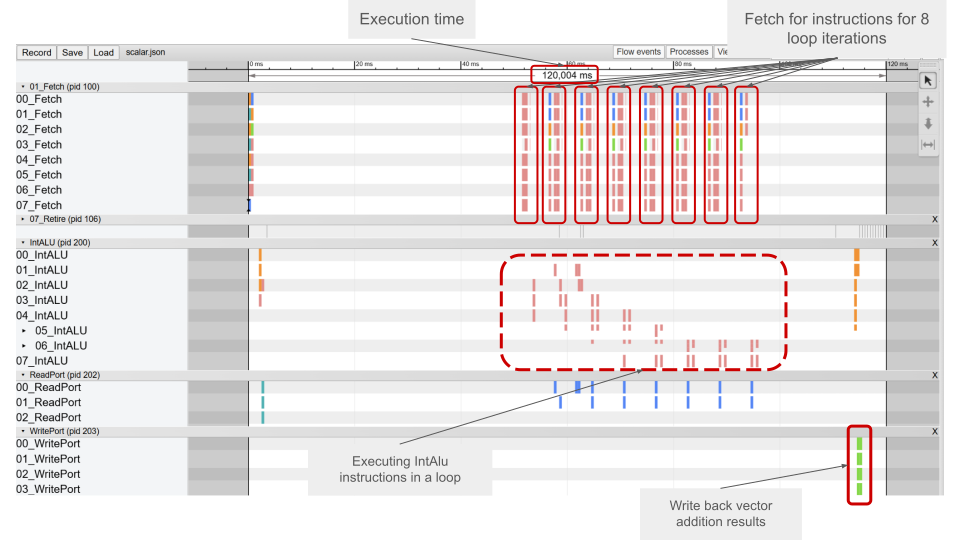
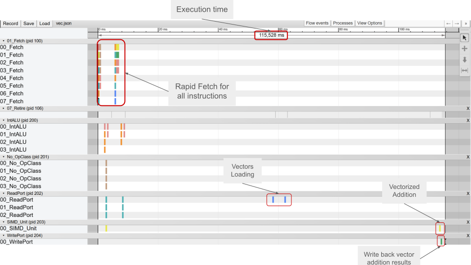

# Vector Addition

## Scalar addition sample

- [Scalar program](scalar.S) performs element-wise addition of two 8-element integer arrays using a scalar loop. Each iteration loads two words, adds them, and stores the result, demonstrating basic integer ALU and memory operations in a sequential pipeline flow.

### Visualization

## Vector addition sample

- [Vector program](vec.S) perfoms the vector addition using RISC-V Vector Extension instructions.
It loads vectors, executes a single vector add, and stores the result, highlighting SIMD parallelism and its impact on pipeline stage occupancy.

### Visualization

## Evaluation

Both traces were captured under identical gem5 simulation conditions (O3CPU, same memory configuration). The execution times reported below are in the **equivalent time units used by Chrome Tracing / Perfetto** – they are not real milliseconds but are directly comparable between the two runs.

| Version  | Execution Time  |
|----------|----------------------------------------|
| Scalar addition sample   |                   120.004              |
| Vector addition sample   |                   115.528              |

**Performance gain:**

$$\frac{120.004 - 115.528}{120.004} \times 100\% \approx 3.73\%$$

The vectorised version completes the addition approximately **3.7% faster** than the scalar loop for this small 8‑element array.
